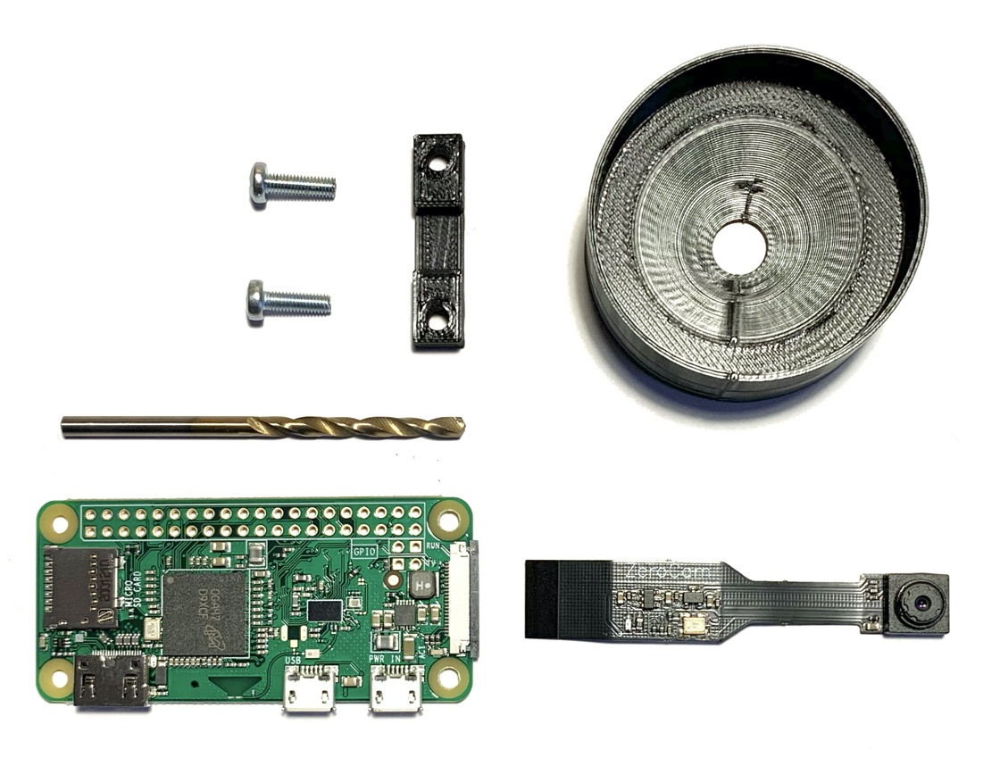
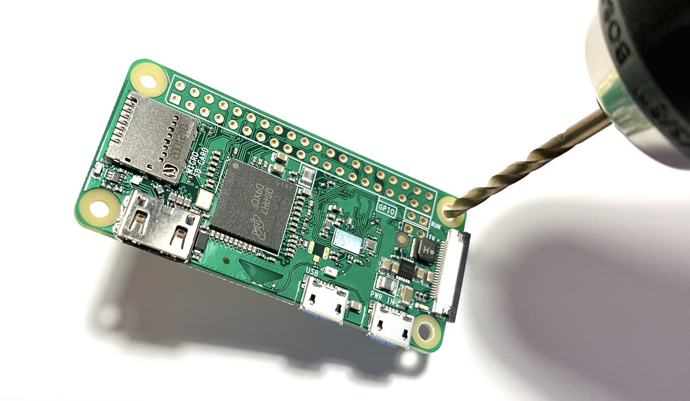
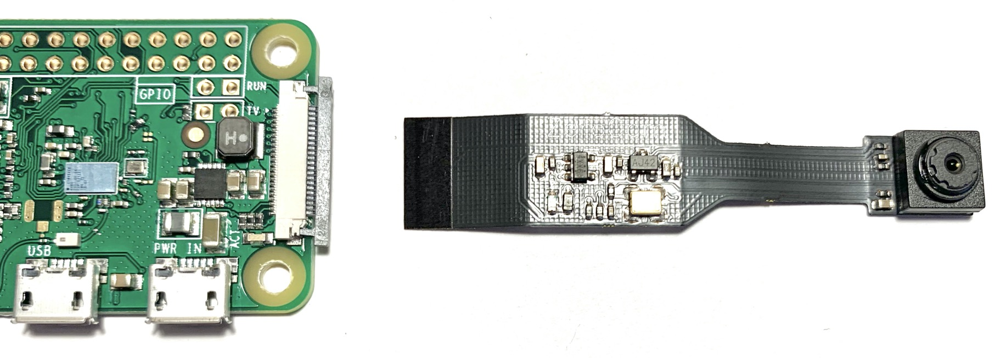
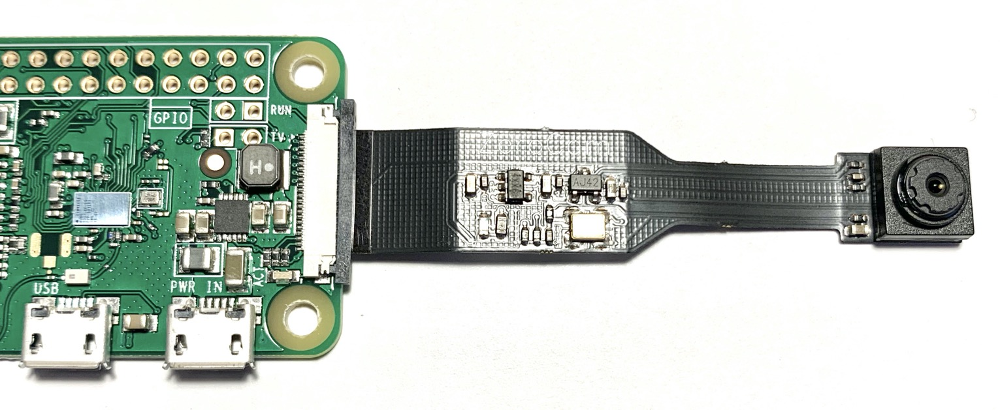
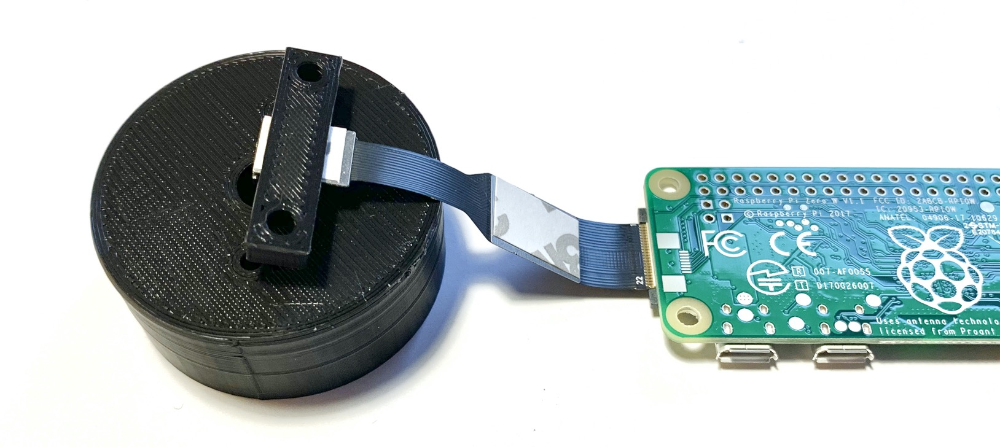
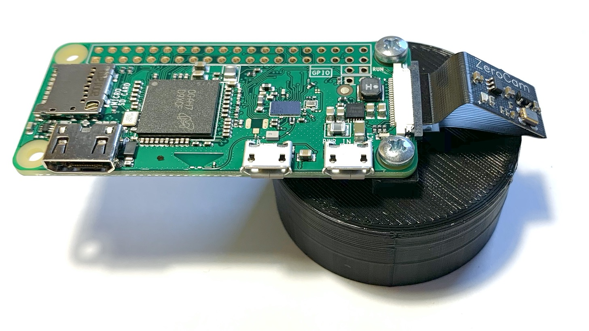
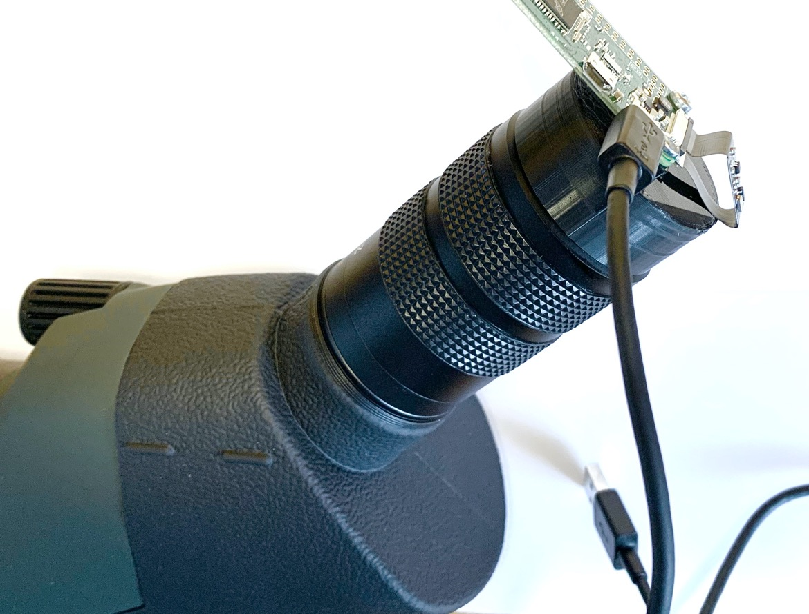

# Spotter setup
## Hardware installation
1. Requirements
    
    - 2x 10 mm M3 screws
    - 1x 3 mm drill
    - 3D printed parts
    - Raspberry Pi with wifi (In this tutorial: *Raspberry Pi Zero W*)
    - Raspberry Pi Camera (In this tutorial: *Pi Zero Camera*)
1. Enlarge the 2 screw holes of the Raspberry Pi on the end with the camera connector
    
1. Pull the black part of the camera connector, insert the camera cable und push back in
    
    
1. Mount the camera and the Raspberry Pi on the 3D-printed parts as shown below
    
    
1. Mount on spotting scope. Connect a USB micro cable on the *PWR IN* port and power the Raspberry Pi up with a USB charger
    

## Software installation
1. Download the [Comitup Lite Image](https://davesteele.github.io/comitup/) and follow this tutorial https://github.com/davesteele/comitup/wiki/Tutorial until you are successfully connected on your Raspberry Pi which is also connected to a wifi with internet access
1. Enable the camera interface: `sudo raspi-config` -> select *Interfacing Options* -> select *Camera* and enable it by selecting *Yes*, then reboot by selecting *Finish* and login via ssh again
1. Install required packages: `sudo apt -y -qq update && apt -qq -y full-upgrade && apt install -qq -y libatlas-base-dev python3-picamera python3-numpy python3-scipy git screen`
1. Download [spotter](https://github.com/beustens/spotter): `git clone https://github.com/beustens/spotter.git`
1. Test the software:
    - `cd spotter/`
    - `./server.py`

    You should get an output like this:
    ```
    INFO:spotter___main__:Started user interface on http://raspberrypi:8000
    INFO:spotter___main__:Press ctrl-C to stop
    ```
    Open the URl in a browser on a device on the same network as the Raspberry Pi. You should see the GUI running. When you are done, go back to the shell on the Raspberry Pi and press ctrl-C to stop the application. The GUI should now not be working anymore.
1. Setup a launcher which starts the server in the background (screen): Create a file *screenrc_spotter-launcher* with this content:
    ```shell
    # to use this config, start screen with
    # * sudo screen -d -m -c /path/to/this_file
    #   starts screen with session name "Spotter"
    #   -> to attach again
    #   screen -x -S Spotter
    #   (if there is only one screen: screen -x)

    sessionname Spotter

    startup_message off

    hardstatus alwayslastline "%{=r .} %-Lw%{= .}%L> %n*%h %t %{-}%+Lw%-7=%{= .}%c%{=r .}"

    screen -t Server bash -c 'cd /home/pi/spotter/ && python3 server.py'
    ```
    You could now launch the software in the background with `screen -d -m -c screenrc_spotter-launcher`. You can check if the screen is running with `screen -ls` and attach to it with `screen -x`. If you terminate the server with **ctrl-c**, the screen is also terminating. If you want the server keep running, press **ctrl-a d** to detach from the screen.
1. Create a systemd startup service which starts the launcher when booting the Raspberry Pi automatically: Create a file *spotter-screen.service* with this content:
    ```
    [Unit]
    Description=Spotter HTTP server launched in a screen
    After=network.target

    [Service]
    Type=forking
    ExecStart=/usr/bin/screen -d -m -c screenrc_spotter-launcher
    WorkingDirectory=/home/pi
    StandardOutput=inherit
    StandardError=inherit
    Restart=on-failure
    User=pi

    [Install]
    WantedBy=multi-user.target
    ```
    - Copy the file to */etc/systemd/system* with `sudo cp spotter-screen.service /etc/systemd/system/spotter-screen.service`
    - Test the service:
        - Start with `sudo systemctl start spotter-screen.service`
        - Get current status with `sudo systemctl status spotter-screen.service`
        - Stop with `sudo systemctl stop spotter-screen.service`
    - Enable the service with `sudo systemctl enable spotter-screen.service`
1. Reboot with `sudo reboot`
1. After a while, the red LED of the camera module should light constantly, which means the spotter server has launched successfully. You should be able to see the GUI on a browser of a computer in the same network as the Raspberry Pi on http://raspberrypi:8000. If you connected to the hotspot of the Raspberry Pi, then it is http://raspberrypi.local:8000.